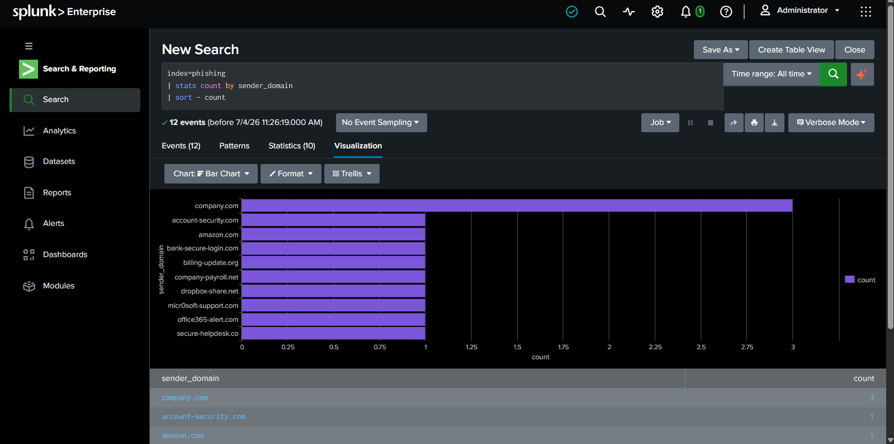
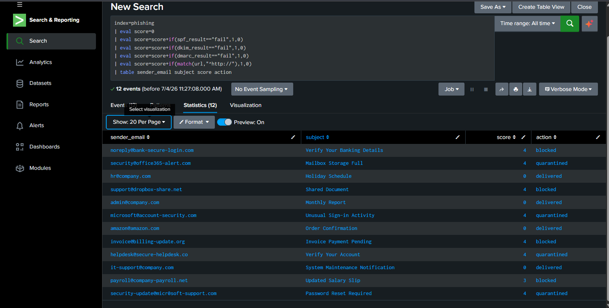
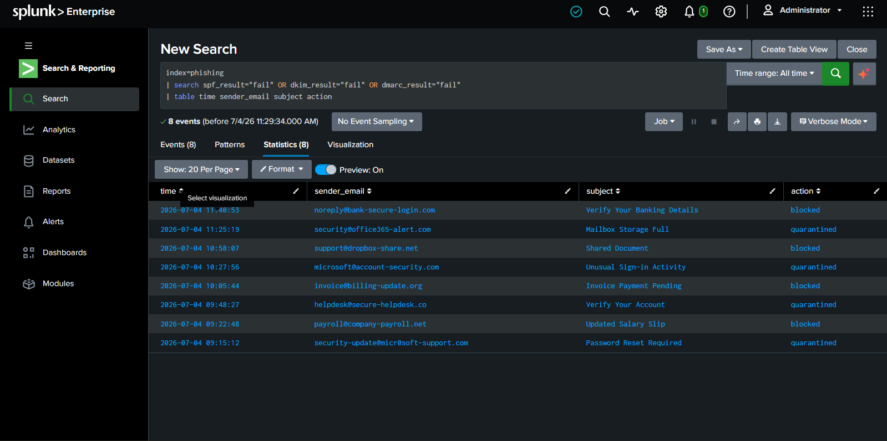
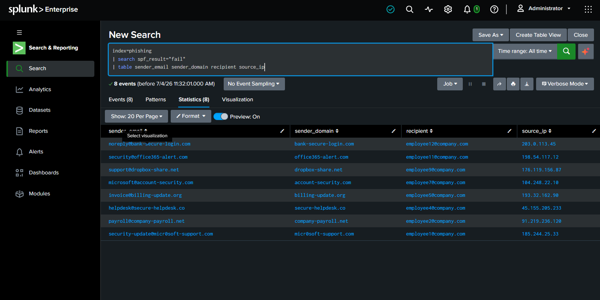
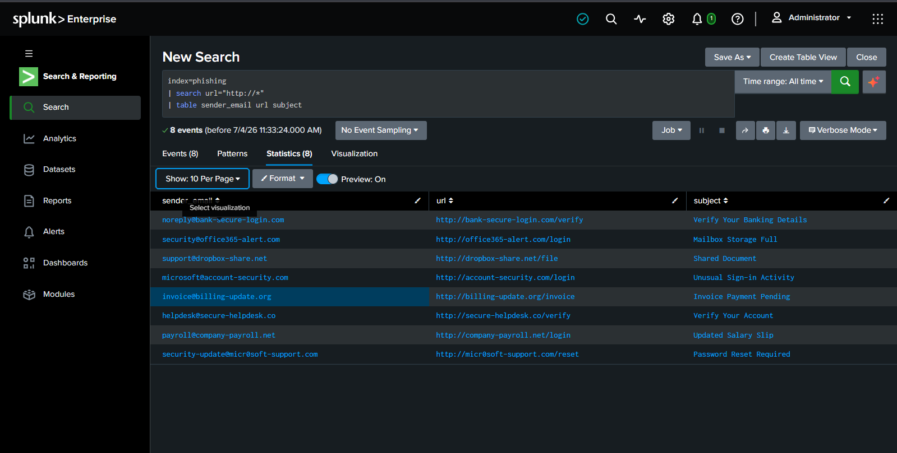
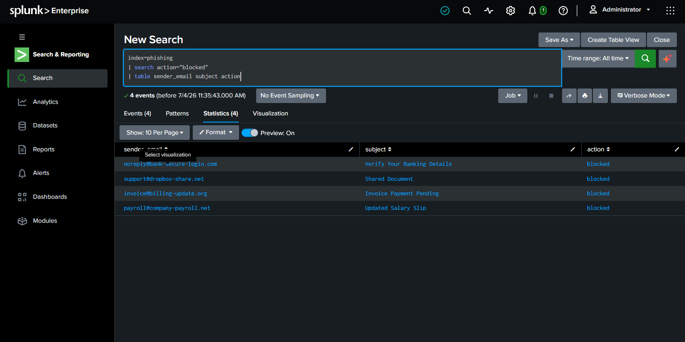
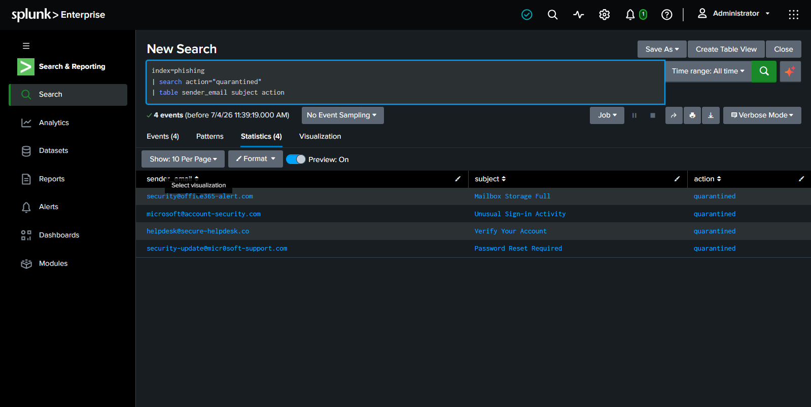
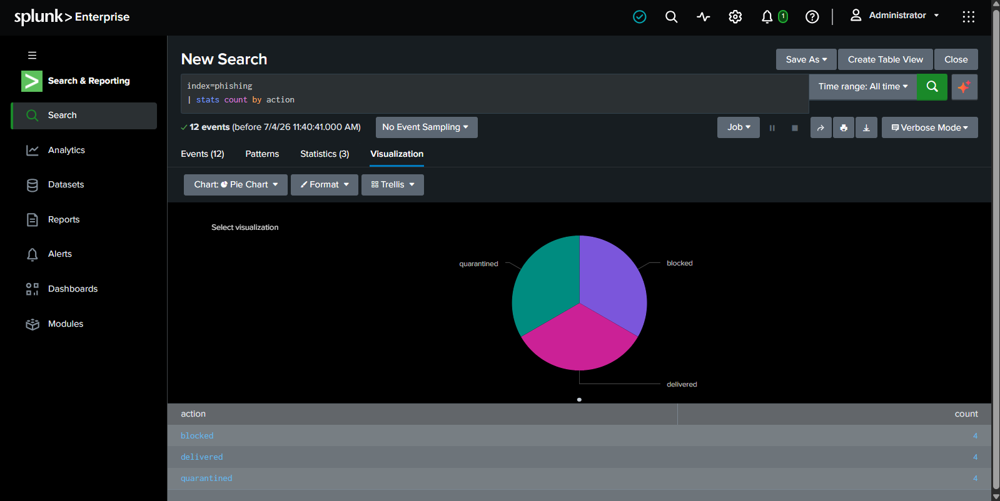
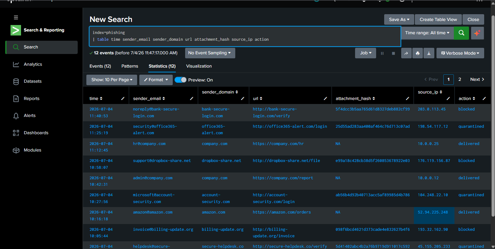

# 📧 Phishing Email Detection System


## 📌 Project Overview

The **Phishing Email Detection System** is a Security Operations Center (SOC) project designed to identify, investigate, and analyze phishing emails using Splunk. The project demonstrates how security analysts detect malicious senders, suspicious URLs, dangerous attachments, and Indicators of Compromise (IOCs) while documenting the investigation process.

This project simulates a real-world phishing investigation workflow and provides practical experience with SIEM-based monitoring, email security analysis, and MITRE ATT&CK mapping.

---

# 🎯 Objectives

- Detect phishing emails
- Identify malicious sender domains
- Detect insecure (HTTP) URLs
- Analyze suspicious attachments
- Extract Indicators of Compromise (IOCs)
- Build Splunk dashboards
- Create investigation reports
- Map detections to MITRE ATT&CK

---

# 🛠️ Technologies Used

- Splunk Enterprise
- Windows
- CSV Dataset
- SPL (Search Processing Language)
- MITRE ATT&CK Framework
- Git & GitHub

---

# 📁 Project Structure

```text
Phishing-Email-Detection-System/
│
├── README.md
├── LICENSE
├── .gitignore
│
├── dataset/
│   └── phishing_email_logs.csv
│
├── queries/
│   ├── suspicious_sender.spl
│   ├── malicious_url.spl
│   ├── attachment_hash.spl
│   ├── phishing_score.spl
│   ├── quarantined_emails.spl
│   ├── blocked_emails.spl
│   ├── sender_domain_analysis.spl
│   ├── suspicious_subjects.spl
│   ├── email_statistics.spl
│   └── ioc_extraction.spl
│
├── docs/
│   ├── investigation_report.md
│   ├── detection_logic.md
│   └── mitre_mapping.md
│
└── screenshots/
    ├── dashboard.png
    ├── sender_analysis.png
    ├── phishing_score.png
    ├── alert.png
    ├── suspicious_sender.png
    ├── malicious_url.png
    ├── blocked_emails.png
    ├── quarantined_emails.png
    ├── email_statistics.png
    └── ioc_extraction.png
```

---

# 🔍 Detection Workflow

Incoming Email

⬇

SPF Validation

⬇

DKIM Validation

⬇

DMARC Validation

⬇

Sender Analysis

⬇

URL Inspection

⬇

Attachment Inspection

⬇

IOC Extraction

⬇

Risk Scoring

⬇

SOC Investigation

⬇

Email Quarantine / Block

---

# 📊 Splunk Queries

| Query | Purpose |
|--------|---------|
| suspicious_sender.spl | Detect suspicious senders |
| malicious_url.spl | Detect HTTP URLs |
| attachment_hash.spl | Analyze attachment hashes |
| phishing_score.spl | Calculate phishing severity |
| quarantined_emails.spl | View quarantined emails |
| blocked_emails.spl | View blocked emails |
| sender_domain_analysis.spl | Analyze sender domains |
| suspicious_subjects.spl | Detect suspicious subjects |
| email_statistics.spl | Email action statistics |
| ioc_extraction.spl | Extract IOCs |

---

# 📸 Screenshots

### Dashboard


---

### Sender Analysis



---

### Phishing Score



---

### Alert Investigation



---

### Suspicious Sender Detection



---

### Malicious URL Detection



---

### Blocked Emails



---

### Quarantined Emails



---

### Email Statistics



---

### IOC Extraction



---

# 🚨 Indicators of Compromise (IOCs)

- Malicious Sender Email
- Suspicious Domain
- HTTP URLs
- Attachment Hashes
- Source IP Addresses

---

# 🛡️ MITRE ATT&CK Mapping

| Tactic | Technique | ID |
|---------|-----------|------|
| Initial Access | Phishing | T1566 |
| Initial Access | Spearphishing Attachment | T1566.001 |
| Initial Access | Spearphishing Link | T1566.002 |
| Credential Access | Input Capture | T1056 |
| Defense Evasion | Masquerading | T1036 |

---

# 📈 Key Features

- SIEM-Based Email Monitoring
- Phishing Detection
- IOC Investigation
- URL Analysis
- Attachment Analysis
- Sender Reputation Analysis
- Security Dashboards
- Threat Investigation
- MITRE ATT&CK Mapping
- Incident Documentation

---

# 🎓 Learning Outcomes

Through this project, I gained hands-on experience in:

- Splunk SPL Queries
- Security Monitoring
- Threat Hunting
- Email Security Analysis
- IOC Investigation
- Blue Team Operations
- SOC Investigation Workflow
- Detection Engineering
- MITRE ATT&CK Mapping

---

# 🚀 Future Improvements

- VirusTotal API Integration
- Email Header Analysis
- GeoIP Enrichment
- Threat Intelligence Integration
- Automated Alerting
- Splunk Dashboard Enhancements
- Risk-Based Scoring

---

# 📄 License

This project is licensed under the MIT License.

---

## 👨‍💻 Author

**Vivek Kandpal**

GitHub: https://github.com/Vivek11commits

LinkedIn: https://www.linkedin.com/in/vivekkandpal/

---

⭐ If you found this project useful, consider giving it a star.